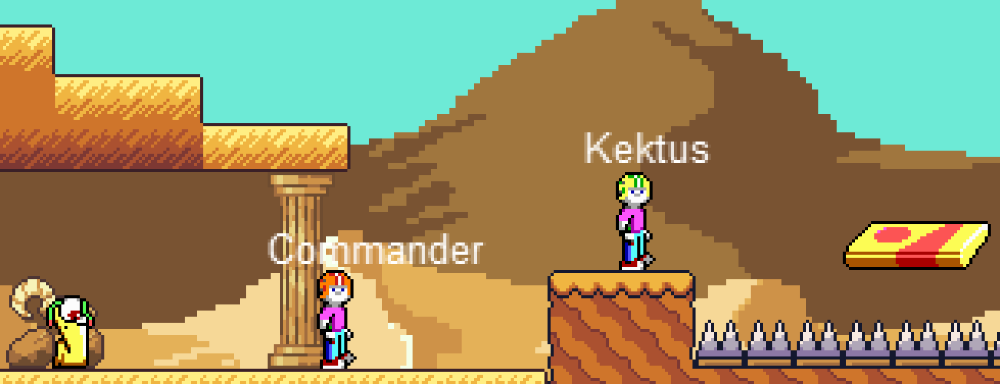

# Commander Kektus

## About
Commander Kektus ist ein Mini-Jump&Run und eine kleine Hommage an Commander Keen von id-Software (https://de.wikipedia.org/wiki/Commander_Keen), welches im Rahmen der Vorlesung "Webprogrammierung" an der DHBW Mannheim entsteht. Es bietet einen Single- und Multiplayer.



## Spielen
### Aktueller Build
https://commander.kektus.de

### Steuerung
- Links/Rechts: Cursor-Taste links/rechts
- Springen: Cursor-Taste hoch
- Schießen: Leertaste

## Technische Aspekte

Eine Einführung in den Aufbau und die technischen Hintergründe findet Ihr unter https://youtu.be/9AYlJAeGg6Y.

### 1. Clientside
- Engine: melon.js (https://www.melonjs.org/)
- Netzwerk: websocket-API (https://developer.mozilla.org/en-US/docs/Web/API/WebSockets_API)
- Frontend: React (https://reactjs.org/)
- Bundler: Parcel2 (https://v2.parceljs.org/)

#### Installation/Nutzung
```shell
git clone https://github.com/theweinzierl/commander-kektus && \
cd commander-kektus/clientside && \
npm install
```

Der lokale Server wird mit `npm run start` gestartet. Ein Build kann mit `npm run build` erstellt werden.

### 2. serverside

Der Multiplayer-Server erfüllt folgende Funktionen
- Anmeldung
- Spielvermittlung
- Datenaustausch
- Chat

und setzt Deno und das websocket-Modul ein (https://deno.land/x/websocket@v0.1.1)

#### Installation/Nutzung

Wenn noch nicht geschehen: clone und cd nach ./serverside/ . Dann:
```shell
deno run --allow-net --allow-read ./server.ts 
```

ACHTUNG: Zur Ausführung des Game-Servers wird ein Zertifikat und ein Private-Key benötigt. Diese können selbst erstellt sein. Unter Umständen muss dann aber im Browser das Zertifikat unter
- https://*meine-deno-server-ip*:8080

separat als Ausnahme hinzugefügt werden. Legt die beiden Dateien als fullchain.pem und privkey.pem in Eurem Home-Verzeichnis ab und erstellt entsprechende Hardlinks im serverside-Verzeichnis.
